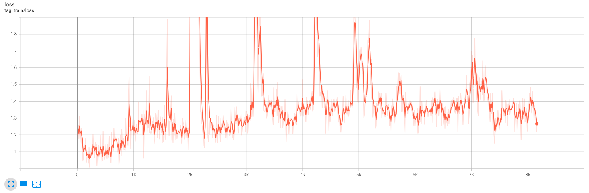
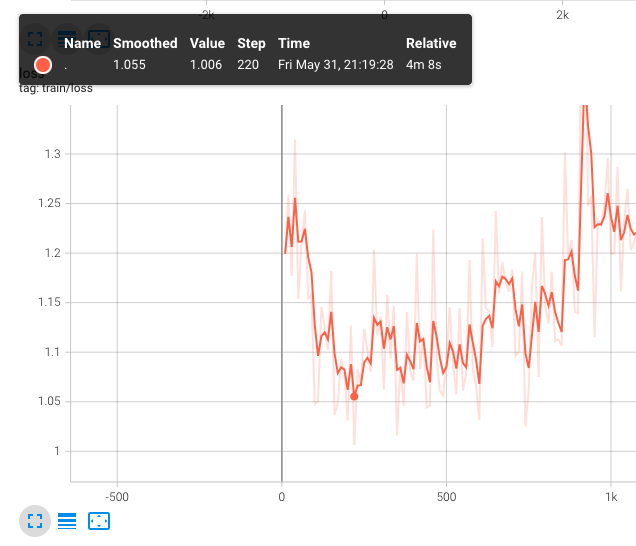
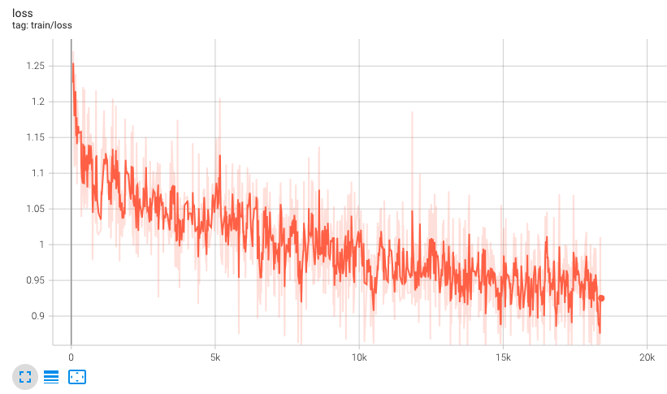
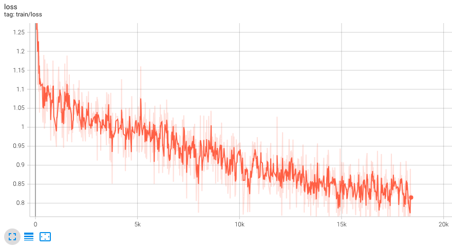

# LLM-Finetuning Examples

## Table of Contents

- [Fine-tune Flan-T5 on Samsung/samsum Dataset with LoRA](#flan-t5-on-samsungsamsum)

## Flan-T5 on Samsung/samsum

Script: `flan-t5_samsum.py`

### Experiment 1: Learning Rate

Purpose: The purpose of this experiment is to investigate the effects of learning rate during LoRA fine-tuning. To compare the impact of different initial learning rates under identical settings, I used a large (1e-3) and a small (1e-4) learning rate.

Below is the training loss when the learning rate is set to 1e-3:



It appears challenging for the training loss to converge with such a large initial learning rate. Specifically, due to the warm-up technique, the learning rate initially is very small, causing the training loss to drop quickly. As the learning rate increases during the warm-up phase, the training loss begins to rise.

What is the appropriate learning rate in this scenario? In TensorBoard, it is observed that after 220 training steps of warm-up, the training loss begins to increase, as illustrated in the figure below. Hence, I determined that the optimal learning rate at this step is approximately 2e-4 from log.



I subsequently trained another model using a smaller initial learning rate of 1e-4, with all other settings remaining the same, except for an increase in the number of training steps. The training loss for this configuration is depicted below:



This time, the training loss decreased significantly, demonstrating much improved convergence.

### Experiment 2: Model Size

Purpose: The objective of this experiment was to assess the effect of model size on LoRa fine-tuning. To this end, I compared two models, **Flan-T5-XL** and **Flan-T5-XXL**, keeping all other settings the same.

Due to hardware limitations, when fine-tuning **Flan-T5-XXL** instead of using the standard pre-trained checkpoint from Google (`google/flan-t5-xxl`), I used a checkpoint in FP16 format from `philschmid/flan-t5-xxl-sharded-fp16`. During the fine-tuning process, I quantized the pre-trained weights to **INT8** format using **bitsandbytes**.

The training loss of **Flan-T5-XL** is depicted below:


The training loss of **Flan-T5-XXL** is depicted below:



As expected, the larger model size resulted in a significantly lower training loss.

After the training phase, I evaluated the models on a testing dataset using the **ROUGE-1** score (%), recorded at each epoch:

| Epoch / Model | Flan-T5-XL | Flan-T5-XXL |
|:-------------:|:----------:|:-----------:|
|       1       |   52.49    |   48.00     |
|       2       |   52.84    |   50.19     |
|       3       |   53.06    |   52.64     |
|       4       |   53.66    |   52.80     |
|       5       |   53.45    |   53.17     |
|       6       |   54.05    |   52.34     |
|       7       |   53.56    |   53.03     |
|       8       |   53.75    |   52.80     |
|       9       |   53.70    |   52.80     |
|       10      |   53.70    |   52.90     |

From the table above, it is evident that the smaller model (Flan-T5-XL) achieved its best performance at Epoch 6, while the larger model (Flan-T5-XXL) reached its peak at Epoch 5. This is quite reasonable considering that the larger model, due to its greater number of fine-tuning parameters, converged faster.

However, interestingly, it appears that the larger model does not generalize as well as the smaller model. This could be due to the current LoRA settings, which add adapter weights to all Q, K, V, and O projections in every attention layer,
```python
lora_config = LoraConfig(
    r=16,
    lora_alpha=32,
    target_modules=["q", "k", "v", "o"],
    lora_dropout=0.05,
    bias="none",
    task_type=TaskType.SEQ_2_SEQ_LM
)
```
resulting in a higher number of fine-tuning parameters in the larger model, and potentially leading to overfitting. Moreover, the larger model also quantizes the original pre-trained weights to INT8 during both training and inference, which could also contribute to its inferior performance.

### Pitfall during Development

1. Why doesn't the HuggingFace Dataset need to be remapped after it has been mapped once?
    
    For example, in the code below, the first execution requires mapping each sample in the Dataset to a function:
    ```python
    tokenized_dataset = dataset.map(
        preprocess_dataset_func,
        batched=True,
        remove_columns=["dialogue", "summary", "id"],
    )
    ```
    However, a second mapping is not required because the data after mapping is stored in a cache. This can be specified using the `cache_file_names` argument, which indicates the path of the cache:
    ```python
    tokenized_dataset = dataset.map(
        preprocess_dataset_func,
        batched=True,
        remove_columns=["dialogue", "summary", "id"],
        cache_file_names={
            "train": f"{CACHE_DIR}/dataset/tokenized_dataset_train",
            "test": f"{CACHE_DIR}/dataset/tokenized_dataset_test",
            "validation": f"{CACHE_DIR}/dataset/tokenized_dataset_validation"
        }
    )
    ```

2. How can some layers in a model be converted to INT8 using BitsAndBytes?

    This primarily involves three steps: Create Config, Load Model with Config, and Prepare Model for Training:
    ```python
    # step 1
    config = BitsAndBytesConfig(load_in_8bit=True)

    # step 2
    model = AutoModelForSeq2SeqLM.from_pretrained(
        MODEL_NAME,
        cache_dir=f"{CACHE_DIR}/model",
        quantization_config=config
    )

    # step 3
    model = prepare_model_for_kbit_training(model)
    ```

3. Certain operations should not be performed on the model during inference, as they will cause the inference results to be incorrect:
    - If the model is quantized with BitsAndBytes, avoid preparing it:
        ```python
        model = prepare_model_for_kbit_training(model)
        ```
    - Avoid creating a Trainer:
        ```python
        trainer = Seq2SeqTrainer(
            model=model,
            args=training_args,
            data_collator=data_collator,
            train_dataset=tokenized_dataset["train"],
        )
        ```

4. During inference, there is no need to manually move the model to a CUDA device, it will be done automatically:
    ```python
    model.cuda()
    ```
    Especially for models quantized with BitsAndBytes, manually moving them to a CUDA device during inference can lead to extremely slow inference speeds and completely incorrect results. However, the exact cause of this issue is unclear.

5. `libcusparse.so.11` not Found:

    When quantizing a model with BitsAndBytes (as mentioned in the three steps in point two), you may encounter an error stating that `libcusparse.so.11` cannot be found. In this case, you need to install `nvidia-pyindex` and `nvidia-cusparse` using `pip`:
    ```
    pip install nvidia-pyindex
    pip install nvidia-cusparse
    ```
    After installation, you can find the `libcusparse.so.11` file in your current Conda environment. For example, I found it in the `env` directory under my own Conda environment folder:
    ```
    /path_to_env/lib/python3.10/site-packages/nvidia/cusparse/lib/libcusparse.so.11
    ```
    Finally, you just need to export this path:
    ```
    export LD_LIBRARY_PATH="/path_to_env/lib/python3.10/site-packages/nvidia/cusparse/lib/libcusparse.so.11"
    ```

6. Remember to specify `max_new_tokens` in `model.generate()`:

   During evaluation, we often perform inference on the model, frequently calling `model.generate()`. According to the [HuggingFace GenerationConfig](https://huggingface.co/docs/transformers/v4.41.3/en/main_classes/text_generation#transformers.GenerationConfig) documentation, if the `max_new_tokens` argument is not specified, it defaults to using `max_length=20`. This condition can cause the model's output to be influenced by the length of the input prompt, preventing an accurate evaluation of the model's performance. Therefore, when using `model.generate()`, remember to specify `max_new_tokens`!


## Create GPT2 from Scratch

Script: `gpt2_from_scratch.py`

